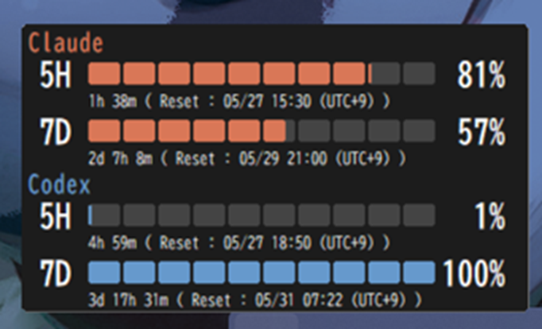

[日本語](#limitchecker-ja) | [English](#limitchecker-en)

<a id="limitchecker-ja"></a>
# LimitChecker

Claude Code と Codex CLI のレートリミット使用状況を Windows タスクトレイからリアルタイムで確認できるデスクトップアプリです。

## スクリーンショット

トレイアイコンにマウスを乗せるか左クリックすると、ポップアップで使用率を確認できます。



## 機能

- **Claude Code** の 5時間枠・7日枠のレートリミット使用率をリアルタイム表示
- **Codex CLI** の 5時間枠・7日枠のレートリミット使用率をリアルタイム表示
- セグメント形式のビジュアルバーで使用率を直感的に把握
- リセットまでの残り時間をローカル時刻で表示
- 更新間隔を 1分 / 5分 / 15分 / 60分 から選択
- タスクトレイ常駐で常時確認可能
- 多重起動防止

## 動作環境

| 項目 | 内容 |
|------|------|
| OS | Windows 10 / Windows 11 |
| 実装言語 | Rust |
| Claude認証 | Claude Code の OAuth / Bearer token |
| Codex認証 | Codex CLI が作成する `.codex/auth.json` |

## 前提条件

以下のいずれかが必要です。

**Claude の使用率表示に必要:**

- [Claude Code](https://claude.ai/code) がインストールされ、ログイン済みであること
  - `%USERPROFILE%\.claude\.credentials.json` または `ANTHROPIC_AUTH_TOKEN` 環境変数が有効

**Codex の使用率表示に必要:**

- [Codex CLI](https://github.com/openai/codex) がインストールされ、`codex login` でログイン済みであること
  - `%USERPROFILE%\.codex\auth.json` が存在すること

> **注意:** 通常の `ANTHROPIC_API_KEY` や `OPENAI_API_KEY` では使用率を取得できません。Claude Code / Codex CLI の OAuth 認証が必要です。

## インストール

### ビルド済みバイナリを使う場合

[Releases](../../releases) から最新の `LimitChecker.exe` をダウンロードして実行してください。

`icon.ico` を `LimitChecker.exe` と同じフォルダに置くとカスタムアイコンを使用できます。

### ソースからビルドする場合

**必要なもの:**

- [Rust](https://www.rust-lang.org/tools/install) (rustup 推奨)
- Windows SDK

```powershell
git clone [https://github.com/Lasagnoa/LimitChecker.git](https://github.com/Lasagnoa/LimitChecker.git)
cd LimitChecker
cargo build --release
```

ビルド成果物:

```
target\release\LimitChecker.exe
```

## 使い方

1. `LimitChecker.exe` を実行するとタスクトレイに常駐します
2. トレイアイコンに**マウスを乗せる**か**左クリック**でポップアップ表示
3. **右クリック**でメニューを開く

### 右クリックメニュー

| 項目 | 動作 |
|------|------|
| 今すぐ更新 | Claude と Codex の使用状況を即時取得 |
| 更新間隔 | 1分 / 5分 / 15分 / 60分 |
| Claude.aiを開く | `https://claude.ai` を既定ブラウザで開く |
| ChatGPTを開く | `https://chatgpt.com/` を既定ブラウザで開く |
| Claude再ログイン | `claude auth login` を実行 |
| Codex再ログイン | `codex login` を実行 |
| ログ(デバッグ用) | `limitchecker.log` 出力のON/OFF |
| status.json を出力 | `status.json` 書き出しのON/OFF |
| 終了 | アプリを終了 |

### 設定ファイル

設定は自動的に保存されます:

```
%APPDATA%\LimitChecker\settings.json
```

### 状態ファイル (status.json) / 外部連携

ポーリングが完了するたびに次のパスに使用率を書き出します。AIアシスタント等の外部ツールから現在のレート状況を読みたい時に使ってください。

```
%APPDATA%\LimitChecker\status.json
```

即時取得用のサブコマンド:

```powershell
LimitChecker.exe --once
```

`--once` は常駐インスタンスと同居して動作し、その場で1回 Claude / Codex の使用率を取得して `status.json` を更新し、同じ JSON を標準出力にも書き出します。詳細スキーマは [SPECIFICATION_JA.md](SPECIFICATION_JA.md) を参照してください。

## トラブルシューティング

**使用率が 0% または表示されない場合:**

- Claude Code / Codex CLI にログインしているか確認してください
- 右クリックメニューから「Claude再ログイン」「Codex再ログイン」を試してください
- 右クリックメニューから「ログ(デバッグ用)」を有効にし、`exe` と同じフォルダの `limitchecker.log` を確認してください

**WSL環境での認証:**

WSL 内の Claude Code / Codex CLI のトークンファイルも自動的に検索します。

## ライセンス

MIT License

## 技術的な詳細

詳細な仕様は [SPECIFICATION_JA.md](SPECIFICATION_JA.md) を参照してください。

---

<a id="limitchecker-en"></a>
# LimitChecker (English)

A desktop application that allows you to check the rate limit usage of Claude Code and Codex CLI in real-time from the Windows task tray.

## Screenshot

Check the usage rate in a popup by hovering or left-clicking the tray icon.


## Features

- Real-time display of Claude Code's 5-hour and 7-day rate limit usage
- Real-time display of Codex CLI's 5-hour and 7-day rate limit usage
- Intuitive visual bars in segment format to grasp usage rates easily
- Displays remaining time until reset in local time
- Selectable update intervals: 1 min / 5 min / 15 min / 60 min
- Resides in the task tray for constant monitoring
- Prevents multiple instances

## Requirements

| Item | Details |
|------|---------|
| OS | Windows 10 / Windows 11 |
| Language | Rust |
| Claude Auth | Claude Code's OAuth / Bearer token |
| Codex Auth | `.codex/auth.json` created by Codex CLI |

## Prerequisites

One of the following is required.

**Required for Claude usage display:**

- [Claude Code](https://claude.ai/code) is installed and logged in
  - `%USERPROFILE%\.claude\.credentials.json` or `ANTHROPIC_AUTH_TOKEN` environment variable is valid

**Required for Codex usage display:**

- [Codex CLI](https://github.com/openai/codex) is installed and logged in via `codex login`
  - `%USERPROFILE%\.codex\auth.json` exists

> **Note:** Usage rates cannot be retrieved with standard `ANTHROPIC_API_KEY` or `OPENAI_API_KEY`. OAuth authentication for Claude Code / Codex CLI is required.

## Installation

### Using pre-built binaries

Download the latest `LimitChecker.exe` from [Releases](../../releases) and run it.

Place `icon.ico` in the same folder as `LimitChecker.exe` to use a custom icon.

### Building from source

**Requirements:**

- [Rust](https://www.rust-lang.org/tools/install) (rustup recommended)
- Windows SDK

```powershell
git clone [https://github.com/Lasagnoa/LimitChecker.git](https://github.com/Lasagnoa/LimitChecker.git)
cd LimitChecker
cargo build --release
```

Build artifact:

```
target\release\LimitChecker.exe
```

## Usage

1. Run `LimitChecker.exe` to keep it in the task tray
2. Hover or left-click the tray icon to show the popup
3. Right-click to open the menu

### Right-click Menu

| Item | Action |
|------|--------|
| Update Now | Immediately fetch Claude and Codex usage |
| Update Interval | 1 min / 5 min / 15 min / 60 min |
| Open Claude.ai | Open `https://claude.ai` in default browser |
| Open ChatGPT | Open `https://chatgpt.com/` in default browser |
| Claude Re-login | Execute `claude auth login` |
| Codex Re-login | Execute `codex login` |
| Log (Debug) | Toggle `limitchecker.log` output |
| Write status.json | Toggle `status.json` output |
| Exit | Exit the application |

### Settings File

Settings are saved automatically:

```
%APPDATA%\LimitChecker\settings.json
```

## Troubleshooting

**If usage is 0% or not displayed:**

- Check if you are logged into Claude Code or Codex CLI
- Try "Claude Re-login" or "Codex Re-login" from the right-click menu
- Enable "Log (Debug)" from the right-click menu and check `limitchecker.log` in the same folder as the `exe`

**Authentication in WSL environment:**

Token files for Claude Code / Codex CLI inside WSL are also searched automatically.

## License

MIT License

## Technical Details

See [SPECIFICATION_EN.md](SPECIFICATION_EN.md) for detailed specifications.
